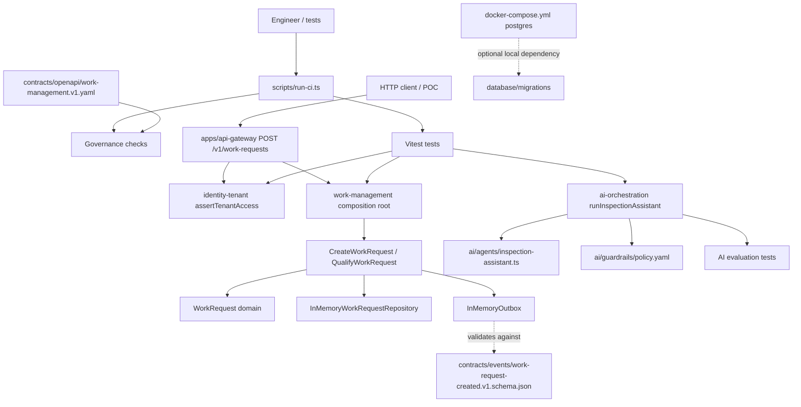

# Architecture Overview

This document describes the architecture that exists in the repository today. It does not describe a production deployment architecture.

## Major Components

| Component | Current responsibility |
| --- | --- |
| `apps/*` | Named app workspaces. `apps/api-gateway` exposes a training/POC HTTP adapter for `POST /v1/work-requests`. Other apps currently export app names only and do not contain runnable UI code. |
| `services/work-management` | Implemented domain slice for `createWorkRequest` and `qualifyWorkRequest`, wired by `services/work-management/src/composition-root.ts`, using application use cases, domain invariants, in-memory adapters, and outbox event payloads. |
| `services/identity-tenant` | Tenant access helper in `services/identity-tenant/src/authorization.ts` used as the current authorization baseline. |
| `services/ai-orchestration` | Inspection assistant orchestration in `services/ai-orchestration/src/inspection-assistant.ts` with tenant checks, citation grounding, output validation, fallback behavior, human-approval checks, audit payloads, and evaluation tests. |
| Other `services/*` | Named service boundaries with minimal `src/index.ts` exports. |
| `packages/*` | Shared package workspaces. `domain-core` exposes a small `Result` helper; contracts and observability packages are placeholders. |
| `contracts/*` | Canonical public contracts: `contracts/openapi/work-management.v1.yaml` and `contracts/events/work-request-created.v1.schema.json`. |
| `database/migrations` | SQL migration draft for platform foundation data structures. |
| `scripts/*` | Validation and governance automation used by `pnpm run validate`. |
| `tests/*` | Repository-level governance, architecture, and contract tests. |

## Dependency Direction

Within services, dependencies move inward:

```text
composition root -> application use case -> domain
infrastructure adapter -> application port -> domain type
```

Repository checks enforce that services do not import other services' source and that domain code does not depend on adapter or transport layers.

## Request And Data Flow

The implemented domain flow is exercised through tests, direct TypeScript use cases, and a training/POC HTTP adapter.

1. An HTTP client calls `POST /v1/work-requests` on `apps/api-gateway` with a synthetic bearer token, or a test builds a work-management composition root directly.
2. The gateway resolves the principal, then `assertTenantAccess` in `services/identity-tenant/src/authorization.ts` before any use-case call.
3. `CreateWorkRequest` validates input through `WorkRequest.create`.
4. The in-memory repository stores the tenant-scoped request by `tenantId:id`.
5. The in-memory outbox records a `WorkRequestCreated` payload.
6. `QualifyWorkRequest` reads by tenant and request ID, checks the domain state transition, saves the updated request, and appends a `WorkRequestQualified` payload. Qualification is not yet exposed over HTTP.

The AI inspection assistant flow is also direct TypeScript execution: caller input plus dependencies enter `runInspectionAssistant`, which authorizes tenant access, retrieves citations, validates tenant boundaries, generates or falls back, validates output shape, and records an audit payload.

## Trust Boundaries

- Tenant boundary: `identity-tenant` and `ai-orchestration` check tenant membership before scoped behavior.
- Contract boundary: public API and event shapes live in `contracts/` and are validated by repository checks.
- AI boundary: product AI behavior enters through `services/ai-orchestration`; direct model-provider SDK imports outside that service are blocked by architecture checks.
- Environment boundary: `.env.example` documents non-secret local variables; committed secrets are blocked by secret-pattern checks.

## External Dependencies

- npm registry for dependency installation and vulnerability audit.
- Docker only for optional local PostgreSQL via `docker-compose.yml`.
- No live cloud, payment, notification, model-provider, or identity-provider integration is implemented.

## Extension Points

- Add service behavior inside the owning service under `src/domain`, `src/application`, and adapters as needed.
- Add public API contracts under `contracts/openapi/`.
- Add event schemas under `contracts/events/`.
- Add AI behavior through `services/ai-orchestration` and versioned artifacts under `ai/`.
- Add repository-level checks under `scripts/` and focused tests under `tests/`.

## Design Constraints

- Keep domain logic independent from framework, database, transport, cloud, and AI-provider SDKs.
- Do not import source from another service.
- Keep public contracts versioned and canonical under `contracts/`.
- Do not add deployment, observability, or release infrastructure until a runnable process needs it and an ADR records the decision.
- Do not allow consequential AI actions without human approval.

## Current Diagram


